# Dev Diagnosis.skill

開發需求分診與治理引導工具。

*在動手之前，先辨識價值。*

---

## 為什麼做這個

高效率生產垃圾還是垃圾。

每次有人說「我想做一個⋯⋯」，最危險的反應是立刻開始做。該問的問題沒問，該查的東西沒查，做完才發現早就有人做過、根本不需要自動化、或者用錯了工具。

Dev Diagnosis 是一個結構化的分診流程——從模糊的需求出發，經過診斷，判斷該用什麼方式開發、如何管理。它不幫你寫 code，它幫你決定要不要寫、怎麼寫、寫完放哪裡。

四個階段：**診斷** → **選解法** → **分級管理** → **落地**。每個階段結束時確認，再進下一步。

## 棧點（Station）

棧點是你的工作環境——一個組織、一個團隊、或一個專案。每個棧點有自己的技術棧、資安限制、開發規範和既有工具清單。

分診流程會根據你所在的棧點，套用對應的規則來判斷。同樣一個需求，在資安要求嚴格的組織可能走受管開發，在個人專案裡可能是自由開發。

用 `_template.md` 為你的棧點建立設定檔，放在 `stations/` 目錄下。

## 在哪裡使用

這個 skill 可以在 Claude.ai 或 Claude Code 中使用，但能做的事不同：

| | Claude.ai | Claude Code |
|---|---|---|
| 對話式分診引導 | v | v |
| 自動讀取棧點設定檔 | x（需手動貼入） | v |
| 建立檔案結構、寫 SKILL.md | x | v |
| 登記到既有 skill 清單 | x | v |
| 建 repo、操作 git | x | v |
| 串接 MCP 工具 | x | v |

簡單說：Claude.ai 能「診斷」，Claude Code 能「診斷 + 落地」。

## 安裝

### Claude Code

將 skill 安裝到你的 git repo 的 `.claude/skills/` 目錄下：

```bash
# Project-level（僅限該專案使用）
mkdir -p .claude/skills
git clone https://github.com/mseatingtpe/dev-diagnosis-skill .claude/skills/dev-diagnosis

# Global（所有專案皆可使用）
git clone https://github.com/mseatingtpe/dev-diagnosis-skill ~/.claude/skills/dev-diagnosis
```

安裝後，當你描述開發需求時會自動觸發，也可以手動呼叫 `/dev-diagnosis`。

### Claude.ai

將 `SKILL.md` 的內容貼入 Project instructions 或對話中即可使用（僅支援診斷，不支援落地操作）。

## 檔案

```
dev-diagnosis-skill/
├── SKILL.md              # 完整的分診引導邏輯
├── _template.md          # 棧點設定檔模板
├── stations/             # 各棧點的設定檔
└── references/           # 補充說明（按需讀取）
    ├── ai-tool-vs-agent.md
    └── health-check.md
```

## 分診報告格式

四個階段走完後，產出一份結構化的分診報告：

```
# 開發需求分診報告

## 診斷
- 問題：[摘要]
- 既有資源：[直接用 / 可改造 / 可串接（列出哪些 + 缺口）/ 重建]
- 延展性：[高 / 中 / 低]

## 解法
- 建議層級：[人工 / 自動化 / AI 工具 / Agent]
- 理由：[說明]

## 管理
- 分級：[受管開發 / 輕量管理 / 自由開發]
- 具體行動：[依棧點設定檔列出]

## 落地
- 產出形式：[Skill / 腳本 / Prompt template / 其他]
- 存放位置：[路徑]
- 既有 skill 清單登記：[是 / 待登記]
- 下一步：[具體行動]
```

## 決策流程圖

```mermaid
flowchart TD
    Start([開發需求]) --> Station{棧點設定檔存在？}
    Station -->|否| CreateStation[引導建立棧點設定檔]
    CreateStation --> FastTrack
    Station -->|是| FastTrack
    FastTrack{使用者已經想清楚了？}
    FastTrack -->|是| QuickReport([直接整理分診報告 → 確認])
    FastTrack -->|否| Entry

    subgraph P1 ["階段一：診斷"]
        Entry{新需求 or 現有工具的問題？}
        Entry -->|新需求| Ask[釐清問題與痛點]
        Entry -->|現有工具的問題| SkillReview

        Ask --> SkillReview{既有 skill 清單}
        SkillReview -->|清單是空的| ColdStart[跳過復盤]
        SkillReview -->|清單有東西| Review[復盤 + 交織性分析]

        Review --> ReviewResult{復盤結論}
        ReviewResult -->|直接用| Done([結束])
        ReviewResult -->|可改造| Refactor[確認改造範圍]
        ReviewResult -->|可串接| Gap[補缺口]
        ReviewResult -->|重建| Extend

        Refactor --> Extend
        Gap --> Extend
        ColdStart --> Extend

        Extend[延展性評估] --> DiagOutput[/診斷摘要 → 使用者確認/]
    end

    subgraph P2 ["階段二：選解法"]
        Auto{需要自動化？}
        Auto -->|否| Manual([維持人工 → 記錄決策])
        Auto -->|是| Degree[自動化程度期待？]

        Degree --> Rule{規則能寫死？}
        Rule -->|是，且期待低| Script[自動化腳本]
        Rule -->|是，但期待高| Multi
        Rule -->|否| Multi{需要多步驟自主決策？}
        Multi -->|否| AITool[AI 工具]
        Multi -->|是| Agent[Agent]

        Script --> ExtendFix
        AITool --> ExtendFix
        Agent --> ExtendFix

        ExtendFix{延展性高？}
        ExtendFix -->|是| Upgrade[建議往上推一層 → 使用者決定]
        ExtendFix -->|否| SolveOutput
        Upgrade --> SolveOutput

        SolveOutput[/解法摘要 → 使用者確認/]
    end

    subgraph P3 ["階段三：分級管理"]
        Tech{"持久化 / 對外接口 / 多人 / 部署？"}
        Tech -->|任一為重| Managed[受管開發]
        Tech -->|有輕無重| Light[輕量管理]
        Tech -->|皆無| Free[自由開發]

        Managed --> LevelOutput
        Light --> LevelOutput
        Free --> LevelOutput

        LevelOutput[/分級摘要 → 使用者確認/]
    end

    subgraph P4 ["階段四：落地"]
        SkillQ{值得寫成 skill？}
        SkillQ -->|是| WriteSkill[建立 skill 結構]
        SkillQ -->|否| Register
        WriteSkill --> Place{管理層級}
        Place -->|受管| Repo[進 GitHub repo]
        Place -->|輕量| RepoLight[進 repo + README]
        Place -->|自由| Personal[存個人空間]
        Repo --> Register
        RepoLight --> Register
        Personal --> Register
        Register[登記到既有 skill 清單] --> NextStep[具體下一步行動]
        NextStep --> Report([產出分診報告])
    end

    DiagOutput --> Auto
    SolveOutput --> Tech
    LevelOutput --> SkillQ
```

<details>
<summary>展開完整流程圖</summary>



</details>
